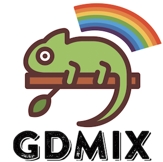
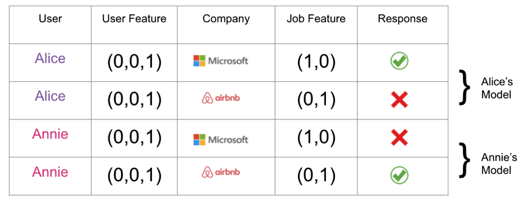
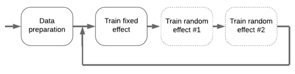
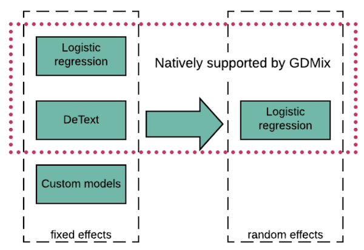
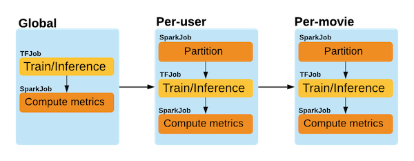
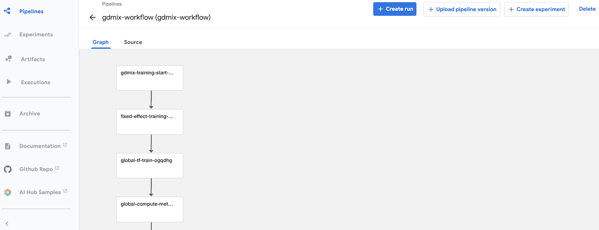

# GDMix


## What is it
Consider a job recommendation task where two LinkedIn members Alice and Annie have very similar profiles. Both of them have the same user features and respond to the same pair of companies. Their responses are exactly opposite to each other. If we use both member's data to train a machine learning model, the model won't be effective since the training samples contradict each other. A solution is to train a single model for each member based on the member's data.
This is an example of personalization.



A possible implementation of personalization is to include all member ID embeddings in a single model. This usually results in a very large model since the number of members can be on the order of hundred of millions. GDMix (Generalized Deep [Mixed model]((https://en.wikipedia.org/wiki/Mixed_model))) is a solution created at LinkedIn to train these kinds of models efficiently. It breaks down a large model into a global model (a.k.a. “[fixed effect](https://en.wikipedia.org/wiki/Fixed_effects_model)”) and a large number of small models (a.k.a. “[random effects](https://en.wikipedia.org/wiki/Random_effects_model)”), then solves them individually. This divide-and-conquer approach allows for efficient training of large personalization models with commodity hardware. An improvement from its predecessor, [Photon ML](https://github.com/linkedin/photon-ml), GDMix expands and supports deep learning models. Check out our [engineering blog](https://engineering.linkedin.com/blog/2020/gdmix--a-deep-ranking-personalization-framework) for more background information.

## Supported models
The current version of GDMix supports logistic regression and [DeText](https://github.com/linkedin/detext) models for the fixed effect, then logistic regression for the random effects. In the future, we may support deep models for random effects if the increase complexity can be justified by improvement in relevance metrics.

### Logistic regression
As a basic classification model, logistic regression finds wide usage in search and recommender systems due to its model simplicity and training efficiency. Our implementation uses Tensorflow for data reading and gradient computation, and utilizes L-BFGS solver from Scipy. This combination takes advantage of the versatility of Tensorflow and fast convergence of L-BFGS. This mode is functionally equivalent to Photon-ML but with improved efficiency. Our internal tests show about 10% to 40% training speed improvement on various datasets.

### DeText models
DeText is a framework for ranking with emphasis on textual features. GDMix supports DeText training natively as a global model. A user can specify a fixed effect model type as DeText then provide the network specifications. GDMix will train and score it automatically and connect the model to the subsequent random effect models. Currently only the pointwise loss function from DeText is allowed to be connected with the logistic regression random effect models.

### Other models
GDMix can work with any deep learning fixed effect models. The interface between GDMix and other models is at the file I/O. A user can train a model outside GDMix, then score the training data with the model and save the scores in files, which are the input to the GDMix random effect training. This enables the user to train random effect models based on scores from a custom  fixed effect model that is not natively supported by GDMix.

## Training efficiency
For logistic regression models, the training efficiency is achieved by parallel training. Since the fixed effect model is usually trained on a large amount of data, synchronous training based on Tensorflow all-reduce operation is utilized. Each worker takes a portion of the training data and compute the local gradient. The gradients are aggregated then fed to the L-BFGS solver. The training dataset for each random effect model is usually small, however the number of models (e.g. individual models for all LinkedIn members) can be on the order of hundred of millions. This requires a partitioning and parallel training strategy, where each worker is responsible for a portion of the population and all the workers train their assigned models independently and simultaneously.

For DeText models, efficiency is achieved by either Tensorflow based parameter server asynchronous distributed training or Horovod based synchronous distributed training.

## How to setup
GDMix has mixed implementation of Python and Scala, which used for training model and processing intermediate data on Spark,
GDMix requires [Python 3.3+](https://www.python.org/downloads) and [Apache Spark 2.0+](http://spark.apache.org/).

### As user
User will need to :
- Install Spark 2.0+
- Download the `gdmix-data` fat jar for intermediate data processing
- Install the `gdmix-trainer` and `gdmix-workflow` python packages
```
version=0.3.0
wget -c https://linkedin.bintray.com/maven/com/linkedin/gdmix/gdmix-data-all_2.11/${version}/gdmix-data-all_2.11-${version}.jar -O gdmix-data-all_2.11.jar

pip install gdmix-trainer gdmix-workflow
```
See more details in the section [Tryout the movieLens example](#Try-out-the-movieLens-example) for a hands-on example and the section [Run GDMix on Kubernetes for distributed training](#Run-GDMix-on-Kubernetes-for-distributed-training) for distributed training.

### As developer
GDMix's Python and Scala module use [setuptools](https://pypi.org/project/setuptools/) and [Gradle](https://gradle.org/) to manage code, respectively. We recommend to use [miniconda](https://docs.conda.io/en/latest/miniconda.html) to manage Python dev virtual environment.
Local build and test is shown below.
```
# Build scala module
./gradlew wrapper --gradle-version  4.5
./gradlew clean build

# Create virtural env
conda create --name gdmix python=3.7.4 -y
conda activate gdmix
pip install pytest

# Install from local gdmix-trainer dev code
cd gdmix-trainer && pip install .
# Run pytest
pytest

# Install from local gdmix-workflow dev code
cd gdmix-workflow && pip install .
# Run pytest
pytest
```

## GDMix implementation
### Implementation overview
The overall GDMix training flow is shown in Figure 1. The data preparation step is provided by user and the input files should meet the requirements shown in the next section [Input data](#Input-data).
The fixed effect captures the global trend and the random effects account for the individuality. The complexity of enormous cross-features from a recommender system is overcomed by taking a [parallel blockwise coordinate descent approach](https://www.kdd.org/kdd2016/papers/files/adf0562-zhangA.pdf), in which the fixed effect and random effects can be regarded as “coordinates”, during each optimization step, we optimize one coordinate at a time and keep the rest constant. By iterating over all the coordinates a few times, we arrive at a solution that is close to the solution to the original problem.

<figure>
  <p align="center"> 
  </br>
  <ficaption>Figure 1: GDMix Overview</ficaption>
  </p>
</figure>

Currently, GDMix supports three different operation modes as shown below.
| Fixed effect |      Random effect |
|----------|:-------------:|
| logistic regression |  logistic regression |
| deep NLP models supported by DeText |    logistic regression |
| arbitrary model designed by a user | logistic regression |

In the last mode, the fixed effect model is trained by the client with his/her own model outside of GDMix, then the scores from that model are treated as input to GDMix random effect training.

<figure>
  <p align="center"> 
  </br>
  <ficaption>Figure 2: GDMix Operation Models</ficaption>
  </p>
</figure>

Figure 3 shows jobs of fixed effect and random effect model training for an example with one fixed effect model `global` and two random effect models `per-user` and `per-movie`. The `global` model is trained on all data and typically requires distributed training; while the random effect models `per-user` and `per-movie` are numerous small independent models according to the entity. To accelerate the random effect model training parallelism, a data partition job is needed to group the records by the entity Id (e.g. user id), which can be done efficiently by Spark. In addition, metrics are computed for each model.

<figure>
  <p align="center"> 
  </br>
  <ficaption>Figure 3: GDMix Workflow Jobs</ficaption>
  </p>
</figure>

### Input data
The input data should be organized in following structure, in which fixed-effect and each random-effect (`per-user` and `per-movie`) has a sub-directory containing `featureList`, `metadata`, `trainingData` and `validationData` directories:
```
├── fixed-effect
│   ├── featureList
│   │   └── global
│   ├── metadata
│   │   └── tensor_metadata.json
│   ├── trainingData
│   │   └── part-00000.tfrecord
│   └── validationData
│       └── part-00000.tfrecord
├── per-user
│   ├── featureList
│   │   └── per_user
│   ├── metadata
│   │   └── tensor_metadata.json
│   ├── trainingData
│   │   └── part-00000.tfrecord
│   └── validationData
│       └── part-00000.tfrecord
├── per-movie
│   ├── featureList
│   │   └── per_movie
│   ├── metadata
│   │   └── tensor_metadata.json
│   ├── trainingData
│   │   └── part-00000.tfrecord
│   └── validationData
│       └── part-00000.tfrecord
```
The `trainingData` and `validationData` are the preprocessed training and validation data in [tfrecord](https://www.tensorflow.org/tutorials/load_data/tfrecord) format; `featureList` directory contains a text file that lists all feature names; `metadata` directory has a json file that stores the number of training samples and metdata such as name, data type, shape and if is sparse vector, which is used to deserialize the tfrecord data. An example for the `global` model is shown below:
```
{
  "numberOfTrainingSamples" : 179087,
  "features" : [ {
    "name" : "weight",
    "dtype" : "float",
    "shape" : [ ],
    "isSparse" : false
  }, {
    "name" : "global",
    "dtype" : "float",
    "shape" : [ 50 ],
    "isSparse" : true
  }, {
    "name" : "uid",
    "dtype" : "long",
    "shape" : [ ],
    "isSparse" : false
  } ],
  "labels" : [ {
    "name" : "response",
    "dtype" : "int",
    "shape" : [ ],
    "isSparse" : false
  } ]
}
```

### GDMix config
GDMix config is a json file that specifies GDMix training related parameters such as input data path, output path, model parameters for fixed-effect/random-effect models, computation resources (distributed only), etc. More detailed information of GDMix config can be found at [gdmix_config.md](gdmix-workflow/gdmix_config.md).

## Try out the [movieLens](https://grouplens.org/datasets/movielens/) example
In this section we will introduce how to train a fixed effect model `global` and two random effect models `per-user` and `per-movie` using GDMix with the [movieLens data](https://grouplens.org/datasets/movielens/). The features for each model are prepared in the script [download_process_movieLens_data.py](scripts/download_process_movieLens_data.py). `per-user` uses feature age, gender and occupation, `per-movie` uses feature genre and release date, and `global` uses all the five features.

### Run GDMix in a container
The easiest way to try the movieLens example is to run it in a pre-built docker container:
```
docker run --name gdmix -it linkedin/gdmix bash
```
- Train logistic regression models for the `global`  `per-user` and `per-movie` (see the section [Train logsitic regression models](#Train-logsitic-regression-models) for details):
```
python -m gdmixworkflow.main --config_path lr-single-node-movieLens.config --jar_path gdmix-data-all_2.11.jar
```
- Train a deep and wide neutal network model for the `global` and two logistic regression models for the `per-user` and `per-movie` (see the section [Train neural network model plus logsitic regression models](#Train-neural-network-model-plus-logsitic-regression-models) for details):
```
python -m gdmixworkflow.main --config_path detext-single-node-movieLens.config --jar_path gdmix-data-all_2.11.jar
```

### Run GDMix directly
To run GDMix directly, user will need to follow the instruction in the section [As user](#As-user), we elaborate the steps below.
Spark installation is required as we haven't supported PySpark yet. We present how to install Spark 2.4.7 on CentOS/RHEL 7.x below, installation on other systems can be done similarly.
```
yum  install -y java-1.8.0-openjdk
export JAVA_HOME=/etc/alternatives/jre
spark_version=2.4.7
spark_pkg=spark-${spark_version}-bin-hadoop2.7
wget https://downloads.apache.org/spark/spark-${spark_version}/${spark_pkg}.tgz
mkdir /opt/spark
tar -xf ${spark_pkg}.tgz && \
    mv ${spark_pkg}/jars /opt/spark && \
    mv ${spark_pkg}/bin /opt/spark && \
    mv ${spark_pkg}/sbin /opt/spark && \
    mv ${spark_pkg}/kubernetes/dockerfiles/spark/entrypoint.sh /opt/ && \
    mv ${spark_pkg}/examples /opt/spark && \
    mv ${spark_pkg}/kubernetes/tests /opt/spark && \
    mv ${spark_pkg}/data /opt/spark && \
    chmod +x /opt/*.sh && \
    rm -rf spark-*
export SPARK_HOME=/opt/spark
export PATH=/opt/spark/bin:$PATH
export SPARK_CLASSPATH=$SPARK_CLASSPATH:/opt/spark/jars/
```
Download and run the provided script [download_process_movieLens_data.py](scripts/download_process_movieLens_data.py) to download and preprocess moveLens data, `--dest_path` can be used to save the result to a different path, default is a `movieLens` directory on current path:
```
wget https://raw.githubusercontent.com/linkedin/gdmix/master/scripts/download_process_movieLens_data.py

pip install pandas
python download_process_movieLens_data.py
```
Download the `gdmix-data` fat jar for spark to process intermediate data:
```
version=0.3.0
wget -c https://linkedin.bintray.com/maven/com/linkedin/gdmix/gdmix-data-all_2.11/${version}/gdmix-data-all_2.11-${version}.jar -O gdmix-data-all_2.11.jar
```
Install python packages `gdmix-trainer` and `gdmix-workflow`:
```
pip install gdmix-trainer gdmix-workflow
```

#### Train logsitic regression models
A GDMix config [lr-single-node-movieLens.config](gdmix-workflow/examples/movielens-100k/lr-single-node-movieLens.config) is provided for the demo purpose, download it and start gdmix training with following command:
```
wget https://raw.githubusercontent.com/linkedin/gdmix/master/gdmix-workflow/examples/movielens-100k/lr-single-node-movieLens.config

python -m gdmixworkflow.main --config_path lr-single-node-movieLens.config --jar_path gdmix-data-all_2.11.jar
```
On a machine with 16 Intel Xeon CPU @ 2.10GHz it took 2 minutes to complete the training. The result directory(from the `output_dir` field in the GDMix config) is shown at the end of the training if it succeeds:
```
------------------------
GDMix training is finished, results are saved to lr-training.
```
The result directory `lr-training` has following structure. The fixed effect and random effect models are save to subdirectory `global`, `per-user` and `per-movie` according to the GDMix config. In each subdirectory, `metric` and `model` directory save the metric on the validation dataset and the trained model(s), the rest are intermediate data for replay or debugging.
```
|-- global
|   |-- metric
|   |   `-- evalSummary.json
|   |-- models
|   |   `-- global_model.avro
|   |-- train_scores
|   |   `-- part-00000.avro
|   `-- validation_scores
|       `-- part-00000.avro
|-- per-movie
|   |-- metric
|   |   `-- evalSummary.json
|   |-- models
|   |   `-- part-00000.avro
|   |-- partition
|   |   |-- metadata
|   |   |   `-- tensor_metadata.json
|   |   |-- partitionList.txt
|   |   |-- trainingData
|   |   |   ...
|   |   `-- validationData
|   |       ...
|   |-- train_scores
|   |   `-- partitionId=0
|   |       `-- part-00000-active.avro
|   `-- validation_scores
|       `-- partitionId=0
|           `-- part-00000.avro
`-- per-user
    |-- metric
    |   `-- evalSummary.json
    |-- models
    |   `-- part-00000.avro
    |-- partition
    |   |-- metadata
    |   |   `-- tensor_metadata.json
    |   |-- partitionList.txt
    |   |-- trainingData
    |   |   ...
    |   `-- validationData
    |       ...
    |-- train_scores
    |   `-- partitionId=0
    |       `-- part-00000-active.avro
    `-- validation_scores
        `-- partitionId=0
            `-- part-00000.avro
```
The metric for each model is summarized in the table below. As we can see, adding random effect models `per-user` and `per-movie` significantly improves the AUC comparing to fixed effect model `global` alone.

|Model   | Type  | AUC  |
|---|:-:|---|
| global  | LR  | 0.6237  |
| per-user  | LR  | 0.7058  |
| per-movie  | LR  | 0.7599   |

#### Train neural network model plus logsitic regression models
As a comparison, we'll train a neural network model supported by DeText for the fixed effect `global` and keep the random effect models unchanged.
We added movie title as an additional feature for the `global` model, and the neural network is the [wide-and-deep ](https://arxiv.org/pdf/1606.07792.pdf) that the movie title is the "deep" and the rest of the features are "wide".

We use the [detext-single-node-movieLens.config](gdmix-workflow/examples/movielens-100k/detext-single-node-movieLens.config) GDMix config to do the training:
```
wget https://raw.githubusercontent.com/linkedin/gdmix/master/gdmix-workflow/examples/movielens-100k/detext-single-node-movieLens.config

python -m gdmixworkflow.main --config_path detext-single-node-movieLens.config --jar_path gdmix-data-all_2.11.jar
```

On a machine with 16 Intel Xeon CPU @ 2.10GHz it took 3 minutes to complete the training. The AUC for each model is shown in the table below. The wide-and-deep fixed effect `global` model performs much better than its logistic regression counterpart (0.7090 v.s. 0.6237), and
the overall AUC is also lifted(0.7680 v.s. 0.7599). We can still see significant improvement from the random effect `per-user` model but not much from `per-movie` model. In production we might deploy the deep-and-wide `global` and logistic regression `per-user` model to simplify model deployment.
|Model   | Type  | AUC  |
|---|:-:|---|
| global  | DeText  | 0.7090  |
| per-user  | LR  | 0.7665  |
| per-movie  | LR  | 0.7680   |

*Please note user might get slight different results due to the random training/validation data partition in [download_process_movieLens_data.py](scripts/download_process_movieLens_data.py)*.


## Distributed training on Kubernetes
Distributed training of GDMix is based on [Kubernetes](https://kubernetes.io/docs/home/). It leverages Kubernetes job scheduling services [Kubeflow](https://www.kubeflow.org/docs/started/getting-started/) and [spark-on-k8s-operator](https://github.com/GoogleCloudPlatform/spark-on-k8s-operator) to run TensorFlow and Spark job distributedly on Kubernetes. It also uses [Kubeflow Pipeline](https://www.kubeflow.org/docs/pipelines/overview/pipelines-overview/) to orchestrate jobs. In this case, a centralized storage is needed for storing training data and models. Users can use
[Kubernetes-HDFS](https://github.com/apache-spark-on-k8s/kubernetes-HDFS/tree/master/charts) or [NFS](https://www.kubeflow.org/docs/other-guides/kubeflow-on-multinode-cluster/#background-on-kubernetes-storage) as the centralized storage.
For more information about distributed training, please refer to [gdmix-workflow README](gdmix-workflow/README.md). The figure below shows a snapshot of the GDMix movieLens example from Kubeflow Pipeline UI.

<figure>
  <p align="center"> 
  </br>
  <ficaption>Figure 4: GDMix Distributed Training on Kubeflow Pipeline</ficaption>
  </p>
</figure>

## Contributing
Please read [CONTRIBUTING.md](CONTRIBUTING.md) for details on our code of conduct, and the process for submitting pull requests to us.

## License
This project is licensed under the BSD 2-CLAUSE LICENSE - see the [LICENSE.md](LICENSE.md) file for details.
